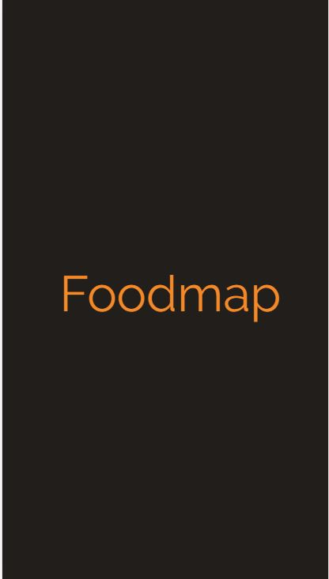

# **Foodmap**

-----------------------------------------------------------------
-----------------------------------------------------------------

## **Objetivo**

Crear una aplicación móvil que a través de un input pueda filtrar los restaurantes que se encuentran cerca del usuario.

## **Conocimiento técnico**

- HTML
- CSS
- Gryd System
- Responsive Web Design
- Bootstrap
- jQuery / Javascript

## **Flujo de la Aplicación**

Vista splash con duración de 2 a 5 segundos que redirecciona a la vista principal.

En la vista principal se muestran todos los restaurantes "cerca del usuario" junto con el input para filtrar su elección.

Ya que se hizo la elección del filtro deben mostrarse únicamente aquellos restaurantes que cumplan con la condición.

Ha sido aplicado un evento mouseover a las imágenes.

Al seleccionar alguno de los restaurantes, debe mostrarse la información de este a través de un modal.

Una vez cerrado el modal debe volver a la vista principal.

